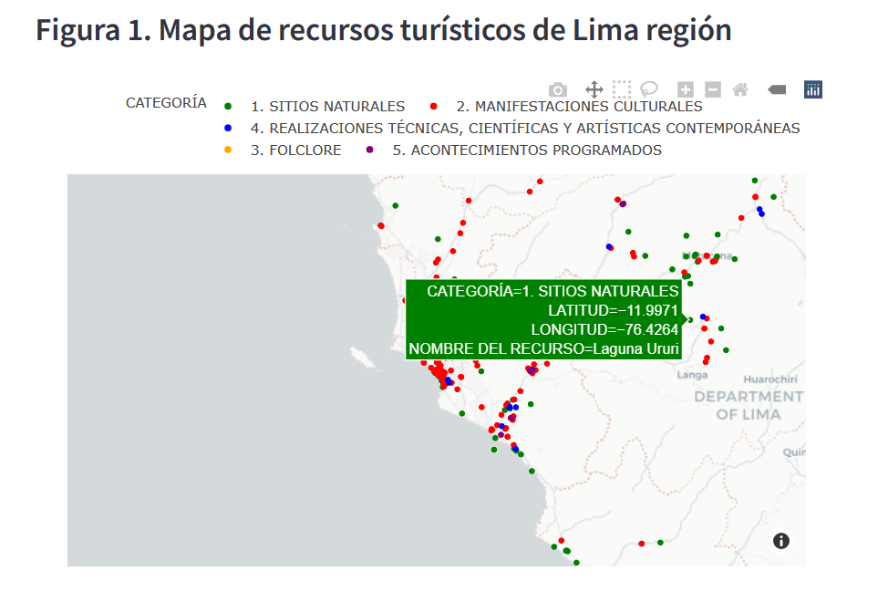

# Inventario de recursos turísticos en Lima región.

## Description

This project georeference the touristic resources of the region of Lima, Perú.

Information had been taken from: https://www.datosabiertos.gob.pe/dataset/inventario-nacional-de-recursos-tur%C3%ADsticos

Touristic resources were grouped by type:

1. Natural places (Sitios Naturales)
2. Cultural manifestations (Manifestaciones Culturales)
3. Folklore (Folclore)
4. Contemporary Technical, Scientific and Artistic Accomplishments (Realizaciones Técnicas, Científicas y Artísticas Contemporáneas)
5. Scheduled events (Acontecimientos programados)

The App allow the user to interact and select a group of resources in order to gather information about each in a table.

## Charts

## Conclusion

This App shows the inventory of tourism resources in Lima, Perú.

By knowing the exact location of each place and showing in an intereactive App bring us the opportunity to explore and detect groups of resources that can be visit together in order to save time to the tourist.

It also allow us to explore a future mathematical tool that can find the shortest path between selected places in order to save time and take advantage of the trip. It could also show recommendations to the tourist based on preferences and closeness of the place.

## References

1. https://www.datosabiertos.gob.pe/dataset/inventario-nacional-de-recursos-tur%C3%ADsticos